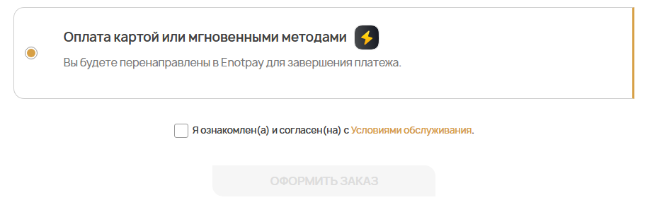
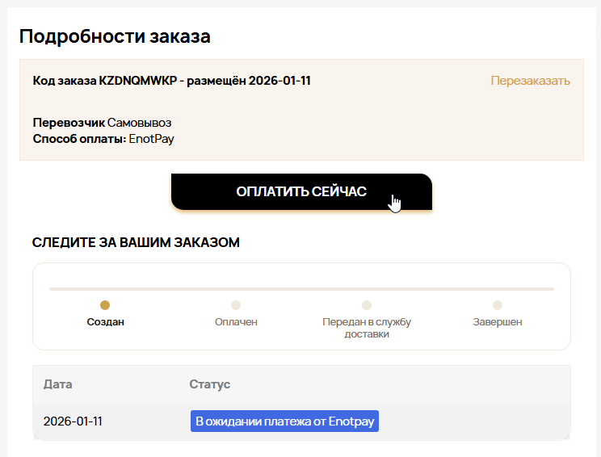
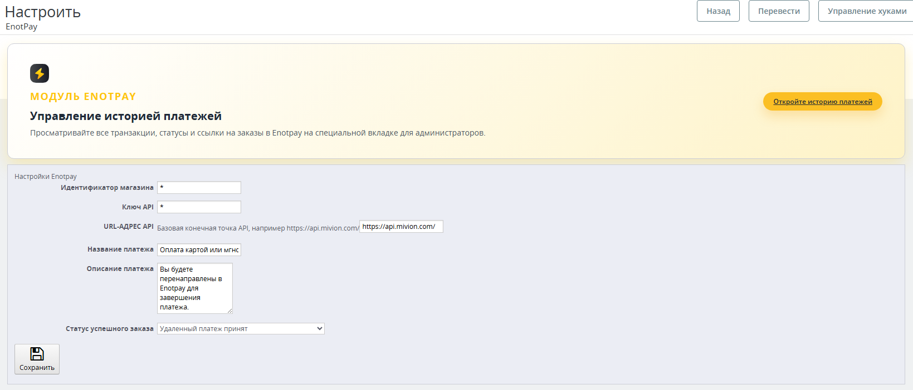
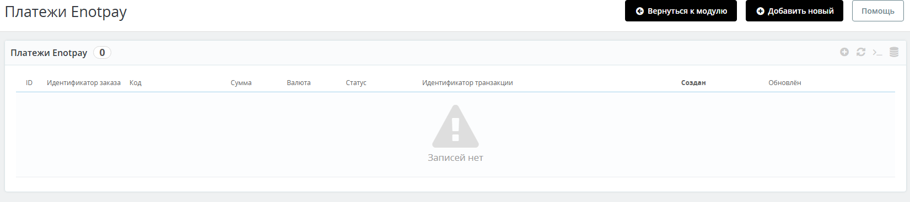

# Модуль оплаты Enotpay для PrestaShop

[🇬🇧 English version](README.md)

Пользовательский модуль оплаты для **CMS PrestaShop (8.2.0+)**, реализующий полноценную интеграцию с платёжной системой **Enotpay** через API.

Модуль полностью русифицирован, использует современный Payment API PrestaShop и корректно работает в стандартном checkout.

---

## 🚀 Возможности

- 🔌 Интеграция с API платёжной системы **Enotpay**
- 💳 Оплата картой и мгновенными методами
- 🛒 Отображение в checkout PrestaShop
- 🔁 **Кнопка «Оплатить сейчас» на странице заказа**
- 🧾 Заказы со статусом «Ожидание оплаты»
- 🔄 Автоматическое обновление статусов заказов
- 📊 История всех платежей в админ-панели
- ⚙️ Настройка через интерфейс администратора
- 🌍 Полная русификация модуля
- 🧠 Использует Advanced Payment API (PaymentOptions)

---

## 🧩 Совместимость

- ✅ **PrestaShop 8.2.0+** — полностью протестировано
- ⚠️ **PrestaShop 8.0.0 – 8.1.x** — не тестировалось

> ⚠️ Модуль тестировался **исключительно на PrestaShop 8.2.0**.  
> Использование на более ранних версиях — **на ваш страх и риск**.

---

## 🛒 Сценарии оплаты

### Оплата при оформлении заказа
Пользователь выбирает Enotpay в списке способов оплаты и перенаправляется на платёжную страницу для завершения оплаты.

---

### Повторная оплата со страницы заказа
Если платёж не был завершён:
- заказ сохраняется со статусом ожидания
- на странице заказа появляется кнопка **«Оплатить сейчас»**
- платёж можно повторить без пересоздания заказа

---

## ⚙️ Административная часть

### Настройки модуля

Доступны:
- идентификатор магазина
- API ключ
- базовый API URL
- название и описание платежа
- статус успешного заказа

---

### История платежей

Отображаются:
- ID заказа
- сумма и валюта
- статус платежа
- идентификатор транзакции
- дата создания и обновления

---

## 📦 Установка

1. Скопируйте папку `enotpay` в: /modules/
2. Установите модуль в админ-панели PrestaShop
3. Заполните настройки Enotpay
4. Готово к использованию

---

## 👨‍💻 Разработчик

**Xardline**

- Telegram: [@xardlinep](https://t.me/xardlinep)
- Discord: `@xardline`

---

## ⚠️ Отказ от ответственности

Модуль предоставляется **«как есть»**.  
Автор не несёт ответственности за возможные ошибки при использовании на версиях PrestaShop ниже **8.2.0**, а также за возможные финансовые потери.

---

## 📄 Лицензия

Лицензия не указана.  
Использование и модификация допускаются по согласованию с автором.
